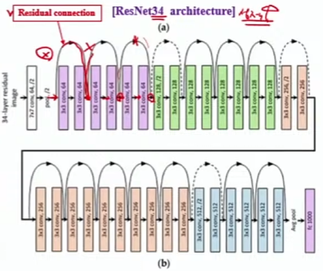
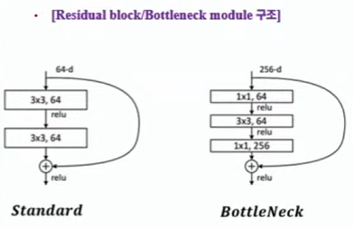
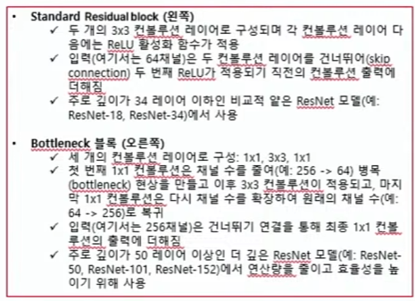
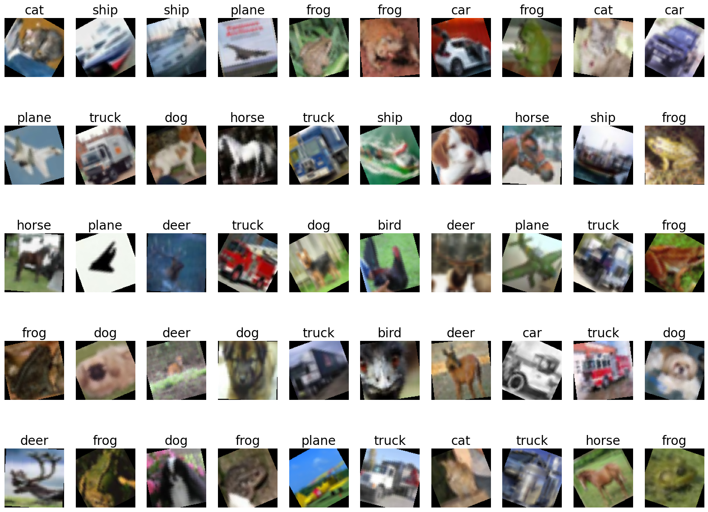
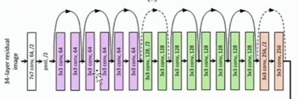
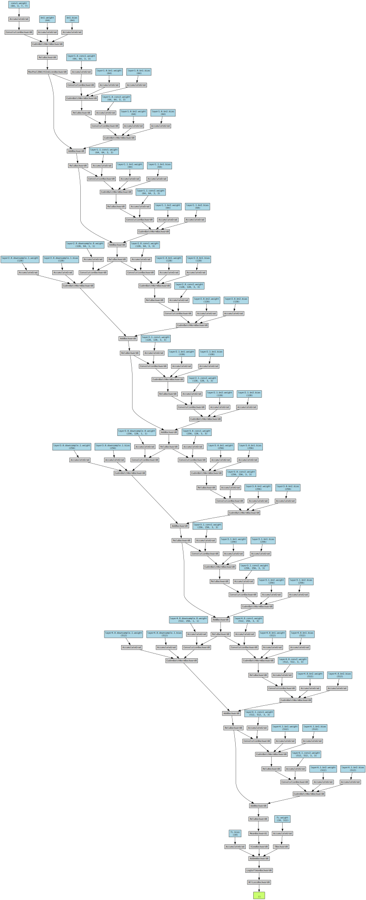
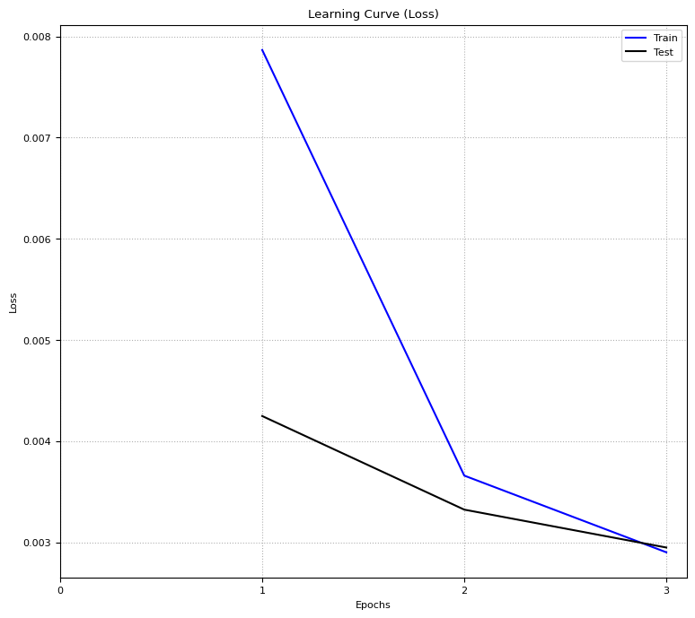
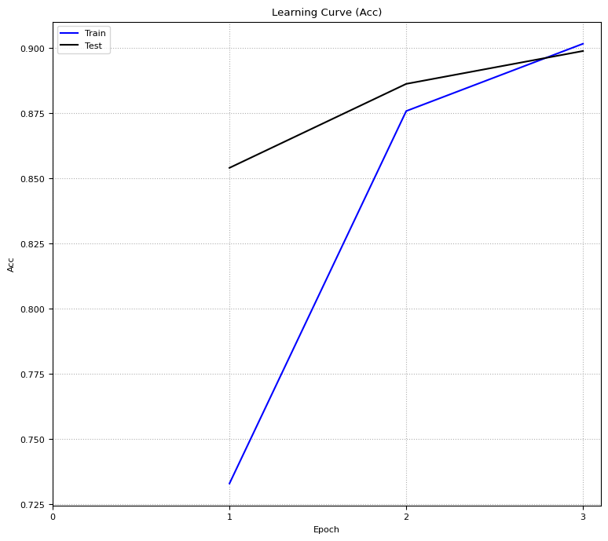
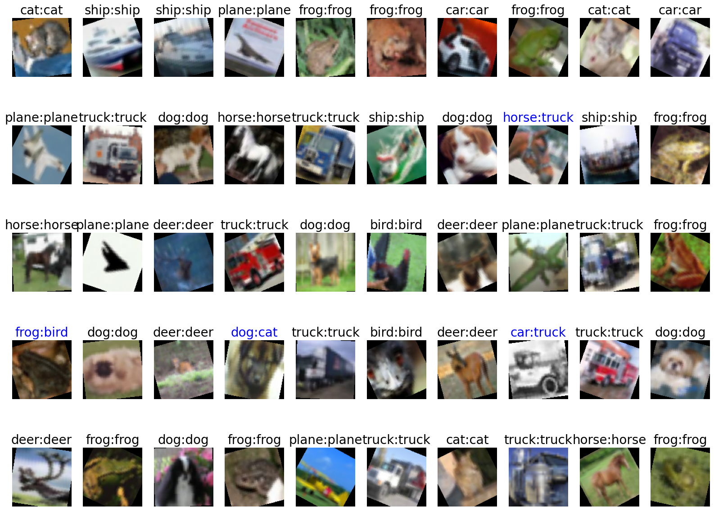

# 14. VGGNet 과 ResNet

> 강의 주제 : 강력한 사전 학습 모델들의 아키텍처 및 핵심 구조 (Residual Block, Skip Connection) 를 이해하고, 이를 통해 더 복잡한 이미지 분류 및 인식 문제를 해결하는 방법을 학습

1. VGG16, VGG19 의 구조와 특징
2. ResNet 의 구조와 특징
    - Residual connection == skip connection 거의 다 씀. skip connection 안들어가는데가 없어
3. Model degradation 문제와 skip connection
4. Pretrained ResNet 모델을 이용한 CIFAR-10 dataset 영상분류
5. Pretrained VGG19 모델을 이용한 CIFAR-10 dataset 영상분류
6. Pretrained 모델 layer 교체

---

## 14-2. ResNet 의 구조와 특징 (project 1 때문에 얘 먼저)

>  skip connection == residual connection 은 깊은 신경망 모델에 거의 다 쓰인다

- 이걸 왜 쓰는가?
    - 레이어를 깊게 쌓으면 쌓을수록, 모델 degradation 문제 발생 
    - 효율성, 성적을 좋게 만들어 주기위해 **반드시 residual(skip) connection 필요**

 


- 깊게 쌓아도 문제가 안생김

### Residual block / Bottleneck 의 구조

  

- Standard Residual block
    - 하나 복사해 둔 다음에, 복사해둔 애를 나중에 더해줌

- Bottleneck block
    - 레이어 50 층 이상 쌓을 때, 연산량 줄이고 효율 높이기 위해서 사용

---

## ResNet 실습


```python
 !pip install torchviz torchinfo
```


```python
import numpy as np
import pandas as pd
import matplotlib.pyplot as plt

import torch
from torch import nn, optim
import torch.nn.functional as F
from torchvision import transforms, datasets, models
from torch.utils.data import DataLoader

device = torch.device('cuda' if torch.cuda.is_available() else 'cpu')
print("device = ", device)
```

    device =  cuda
    


```python
# plot default setting
plt.rcParams['font.size'] = 8
plt.rcParams['figure.figsize'] = (4, 4)
plt.rcParams['axes.grid'] = True
plt.rcParams['grid.linestyle'] = ":"
plt.rcParams['axes.unicode_minus'] = False
```


```python
!git clone https://github.com/wikibook/pythonlibs.git
```

    fatal: destination path 'pythonlibs' already exists and is not an empty directory.
    


```python
from pythonlibs.torch_lib1 import *
```

# ResNet 모델 불러오기

#### 1. (모델 부르기 전에 ) 분류 라벨 먼저 지정하기


```python
## 모델 부르기 전에! classes 먼저 정의
classes = ('plane', 'car', 'bird', 'cat', 'deer',
            'dog', 'frog', 'horse', 'ship', 'truck')    # CIFAR-10

num_classes = len(classes)  # 10 개
```

#### 2. (모델 부르기 전에) 데이터 다운로드

- 2-1. *transforms 정의* 가 가장 먼저 해야할 일
- 2-2. 데이터 다운로드
- 2-3. batch size 로 데이터 나누기 by DataLoader


```python
## 2-1. transforms 정의
# train 
transform_train = transforms.Compose(
    # 리스트
    [
        # CIFAR-10 데이터 이미지 사이즈는 32x32 -> 너무 작기 때문에 -> resize 진행 (112x112)
        transforms.Resize(112),
        transforms.RandomRotation(30),   # 각도 30 으로 로테이션
        transforms.RandomHorizontalFlip(0.5),
        transforms.ToTensor(),
        transforms.Normalize(0.5, 0.5)
    ]
)


# test
transform_test = transforms.Compose(
    # 리스트
    [
        # CIFAR-10 데이터 이미지 사이즈는 32x32 -> 너무 작기 때문에 -> resize 진행 (112x112)
        transforms.Resize(112),

        ## test 에서는 필요없는 부분
        # transforms.RandomRotation(30),   # 각도 30 으로 로테이션
        # transforms.RandomHorizontalFlip(0.5),

        transforms.ToTensor(),
        transforms.Normalize(0.5, 0.5)
    ]
)

```


```python
## 2-2. 데이터 다운로드 받기
data_root = "./data"

## (1) Train
train_set = datasets.CIFAR10(
    data_root,
    True,
    transform_train,
    download = True
)

## (2) Test
test_set = datasets.CIFAR10(
    data_root,
    False,
    transform_train,
    download = True
)
```


```python
## 2-3. batch_size 로 데이터 나누기

# batch
batch_size = 100

# (1) Train
train_loader = DataLoader(
    dataset = train_set,
    batch_size = batch_size,
    shuffle = True
)

# (2) Test
test_loader = DataLoader(
    dataset = test_set,
    batch_size = batch_size,
    shuffle = False
)
```

#### (Optional) 모델 불러서 학습 시키기 전, raw datasets (CIFAR-10) 확인

- `show_images_labels()`


```python
show_images_labels(test_loader, classes, None, None)
```


    

    


## 3. 이제 찐으로 ResNet 모델 불러오기



- ResNet 쌓여있는 레이어층들을 보면, skip connection 이 전에 *똑같은 블럭이* **두 번씩 반복**된다


```python
# weight 먼저 가져오기
weight = models.ResNet18_Weights.IMAGENET1K_V1

# model 불러오기
resnet18 = models.resnet18(weights = weight)

print("resnet18 = ", resnet18)  # 모델 네트워크 출력해보기

'''
skip connection : 이미지 카피해 뒀다가 레이어에 도달하면 복붙해주는거 

- conv 블럭도 두 번씩 반복된다? -> 반복되서 불리니까 모듈화 (nn.Sequential) 해두면 좋음!
- 예:
(0): BasicBlock(
      (conv1): Conv2d(64, 64, kernel_size=(3, 3), stride=(1, 1), padding=(1, 1), bias=False)
      (bn1): BatchNorm2d(64, eps=1e-05, momentum=0.1, affine=True, track_running_stats=True)
      (relu): ReLU(inplace=True)
      (conv2): Conv2d(64, 64, kernel_size=(3, 3), stride=(1, 1), padding=(1, 1), bias=False)
      (bn2): BatchNorm2d(64, eps=1e-05, momentum=0.1, affine=True, track_running_stats=True)
    )
'''
```


```python
from torchinfo import summary

summary(resnet18, (100, 3, 112, 112))    # [batch_size, channels, height, width]

# 근데 이렇게 summary 로 뽑으면 skip connection 같은 경우, 보이지 않음 -> 한계
## 맨 마지막엔 무조건 AdaptiveAvgPool2d 들어가 있다?
# 👉 이 adaptiveAvgPool 덕분에 이미지 사이즈가 어떤거든 다 넣을 수 있음. 짜피 1x1 가 되니깐
## Total params: 11,689,512 👉 파라미터 수 VGG 의 1/10, 근데! 성능은 더 좋음 
```


    ==========================================================================================
    Layer (type:depth-idx)                   Output Shape              Param #
    ==========================================================================================
    ResNet                                   [100, 1000]               --
    ├─Conv2d: 1-1                            [100, 64, 56, 56]         9,408
    ├─BatchNorm2d: 1-2                       [100, 64, 56, 56]         128
    ├─ReLU: 1-3                              [100, 64, 56, 56]         --
    ├─MaxPool2d: 1-4                         [100, 64, 28, 28]         --
    ├─Sequential: 1-5                        [100, 64, 28, 28]         --
    │    └─BasicBlock: 2-1                   [100, 64, 28, 28]         --
    │    │    └─Conv2d: 3-1                  [100, 64, 28, 28]         36,864
    │    │    └─BatchNorm2d: 3-2             [100, 64, 28, 28]         128
    │    │    └─ReLU: 3-3                    [100, 64, 28, 28]         --
    │    │    └─Conv2d: 3-4                  [100, 64, 28, 28]         36,864
    │    │    └─BatchNorm2d: 3-5             [100, 64, 28, 28]         128
    │    │    └─ReLU: 3-6                    [100, 64, 28, 28]         --
    │    └─BasicBlock: 2-2                   [100, 64, 28, 28]         --
    │    │    └─Conv2d: 3-7                  [100, 64, 28, 28]         36,864
    │    │    └─BatchNorm2d: 3-8             [100, 64, 28, 28]         128
    │    │    └─ReLU: 3-9                    [100, 64, 28, 28]         --
    │    │    └─Conv2d: 3-10                 [100, 64, 28, 28]         36,864
    │    │    └─BatchNorm2d: 3-11            [100, 64, 28, 28]         128
    │    │    └─ReLU: 3-12                   [100, 64, 28, 28]         --
    ├─Sequential: 1-6                        [100, 128, 14, 14]        --
    │    └─BasicBlock: 2-3                   [100, 128, 14, 14]        --
    │    │    └─Conv2d: 3-13                 [100, 128, 14, 14]        73,728
    │    │    └─BatchNorm2d: 3-14            [100, 128, 14, 14]        256
    │    │    └─ReLU: 3-15                   [100, 128, 14, 14]        --
    │    │    └─Conv2d: 3-16                 [100, 128, 14, 14]        147,456
    │    │    └─BatchNorm2d: 3-17            [100, 128, 14, 14]        256
    │    │    └─Sequential: 3-18             [100, 128, 14, 14]        8,448
    │    │    └─ReLU: 3-19                   [100, 128, 14, 14]        --
    │    └─BasicBlock: 2-4                   [100, 128, 14, 14]        --
    │    │    └─Conv2d: 3-20                 [100, 128, 14, 14]        147,456
    │    │    └─BatchNorm2d: 3-21            [100, 128, 14, 14]        256
    │    │    └─ReLU: 3-22                   [100, 128, 14, 14]        --
    │    │    └─Conv2d: 3-23                 [100, 128, 14, 14]        147,456
    │    │    └─BatchNorm2d: 3-24            [100, 128, 14, 14]        256
    │    │    └─ReLU: 3-25                   [100, 128, 14, 14]        --
    ├─Sequential: 1-7                        [100, 256, 7, 7]          --
    │    └─BasicBlock: 2-5                   [100, 256, 7, 7]          --
    │    │    └─Conv2d: 3-26                 [100, 256, 7, 7]          294,912
    │    │    └─BatchNorm2d: 3-27            [100, 256, 7, 7]          512
    │    │    └─ReLU: 3-28                   [100, 256, 7, 7]          --
    │    │    └─Conv2d: 3-29                 [100, 256, 7, 7]          589,824
    │    │    └─BatchNorm2d: 3-30            [100, 256, 7, 7]          512
    │    │    └─Sequential: 3-31             [100, 256, 7, 7]          33,280
    │    │    └─ReLU: 3-32                   [100, 256, 7, 7]          --
    │    └─BasicBlock: 2-6                   [100, 256, 7, 7]          --
    │    │    └─Conv2d: 3-33                 [100, 256, 7, 7]          589,824
    │    │    └─BatchNorm2d: 3-34            [100, 256, 7, 7]          512
    │    │    └─ReLU: 3-35                   [100, 256, 7, 7]          --
    │    │    └─Conv2d: 3-36                 [100, 256, 7, 7]          589,824
    │    │    └─BatchNorm2d: 3-37            [100, 256, 7, 7]          512
    │    │    └─ReLU: 3-38                   [100, 256, 7, 7]          --
    ├─Sequential: 1-8                        [100, 512, 4, 4]          --
    │    └─BasicBlock: 2-7                   [100, 512, 4, 4]          --
    │    │    └─Conv2d: 3-39                 [100, 512, 4, 4]          1,179,648
    │    │    └─BatchNorm2d: 3-40            [100, 512, 4, 4]          1,024
    │    │    └─ReLU: 3-41                   [100, 512, 4, 4]          --
    │    │    └─Conv2d: 3-42                 [100, 512, 4, 4]          2,359,296
    │    │    └─BatchNorm2d: 3-43            [100, 512, 4, 4]          1,024
    │    │    └─Sequential: 3-44             [100, 512, 4, 4]          132,096
    │    │    └─ReLU: 3-45                   [100, 512, 4, 4]          --
    │    └─BasicBlock: 2-8                   [100, 512, 4, 4]          --
    │    │    └─Conv2d: 3-46                 [100, 512, 4, 4]          2,359,296
    │    │    └─BatchNorm2d: 3-47            [100, 512, 4, 4]          1,024
    │    │    └─ReLU: 3-48                   [100, 512, 4, 4]          --
    │    │    └─Conv2d: 3-49                 [100, 512, 4, 4]          2,359,296
    │    │    └─BatchNorm2d: 3-50            [100, 512, 4, 4]          1,024
    │    │    └─ReLU: 3-51                   [100, 512, 4, 4]          --
    ├─AdaptiveAvgPool2d: 1-9                 [100, 512, 1, 1]          --
    ├─Linear: 1-10                           [100, 1000]               513,000
    ==========================================================================================
    Total params: 11,689,512
    Trainable params: 11,689,512
    Non-trainable params: 0
    Total mult-adds (G): 48.54
    ==========================================================================================
    Input size (MB): 15.05
    Forward/backward pass size (MB): 1009.64
    Params size (MB): 46.76
    Estimated Total Size (MB): 1071.46
    ==========================================================================================


```python
print(resnet18) # 네트워크 출력

# 맨 마지막 fc 레이어 👇
# (fc): Linear(in_features=512, out_features=1000, bias=True)
## 🫸 사용하는 목적에 맞게 fc 레이어를 수정해야함
```

    ResNet(
      (conv1): Conv2d(3, 64, kernel_size=(7, 7), stride=(2, 2), padding=(3, 3), bias=False)
      (bn1): BatchNorm2d(64, eps=1e-05, momentum=0.1, affine=True, track_running_stats=True)
      (relu): ReLU(inplace=True)
      (maxpool): MaxPool2d(kernel_size=3, stride=2, padding=1, dilation=1, ceil_mode=False)
      (layer1): Sequential(
        (0): BasicBlock(
          (conv1): Conv2d(64, 64, kernel_size=(3, 3), stride=(1, 1), padding=(1, 1), bias=False)
          (bn1): BatchNorm2d(64, eps=1e-05, momentum=0.1, affine=True, track_running_stats=True)
          (relu): ReLU(inplace=True)
          (conv2): Conv2d(64, 64, kernel_size=(3, 3), stride=(1, 1), padding=(1, 1), bias=False)
          (bn2): BatchNorm2d(64, eps=1e-05, momentum=0.1, affine=True, track_running_stats=True)
        )
        (1): BasicBlock(
          (conv1): Conv2d(64, 64, kernel_size=(3, 3), stride=(1, 1), padding=(1, 1), bias=False)
          (bn1): BatchNorm2d(64, eps=1e-05, momentum=0.1, affine=True, track_running_stats=True)
          (relu): ReLU(inplace=True)
          (conv2): Conv2d(64, 64, kernel_size=(3, 3), stride=(1, 1), padding=(1, 1), bias=False)
          (bn2): BatchNorm2d(64, eps=1e-05, momentum=0.1, affine=True, track_running_stats=True)
        )
      )
      ...
      )
      (avgpool): AdaptiveAvgPool2d(output_size=(1, 1))
      (fc): Linear(in_features=512, out_features=1000, bias=True)
    

### 사전 학습 모델의 마지막 FC layer 에 접근해 수정하는 방법을 알아보자.

#### 👀 접근 방법 :

1. 레이어 이름으로 접근하기 : print(`resnet18.fc`)

2. 레이어 특정 파라미터에 접근하고 싶을 때 : print(`resnet18.fc.in_features`)


```python

print(resnet18.fc)
```

    결과 : Linear(in_features=512, out_features=1000, bias=True)


```python
print(resnet18.fc.in_features) # 512
```


    결과 : 512

#### 왜 특정 레이어에 접근해야하는가?

- 우리가 사용할 데이터 셋 : CIFAR-10 -> 클래스 라벨 `10 개`
- ResNet 이 사전 학습시킬 때 사용한 데이터셋 : ImageNet -> 클래스 라벨 `1000 개`

> 출력 노드 개수 불일치 현상이 나타나서 에러 발생하게 된다. 모델의 출력 값을 내 상황에 맞게 교체 필요

#### 🙋🏻‍♀️ 모델 출력 값 수정하기 : in_features  또는 my_in_features 로 지정

```python
my_in_features = resnet18.fc.in_features

resnet18.fc = nn.Linear(my_in_features, num_classes)   

print(resnet18) # 수정 후, 결과 확인 용
```

    ResNet(
      (conv1): Conv2d(3, 64, kernel_size=(7, 7), stride=(2, 2), padding=(3, 3), bias=False)
      (bn1): BatchNorm2d(64, eps=1e-05, momentum=0.1, affine=True, track_running_stats=True)
      (relu): ReLU(inplace=True)
      (maxpool): MaxPool2d(kernel_size=3, stride=2, padding=1, dilation=1, ceil_mode=False)
      (layer1): Sequential(
        (0): BasicBlock(
          (conv1): Conv2d(64, 64, kernel_size=(3, 3), stride=(1, 1), padding=(1, 1), bias=False)
          (bn1): BatchNorm2d(64, eps=1e-05, momentum=0.1, affine=True, track_running_stats=True)
          (relu): ReLU(inplace=True)
          (conv2): Conv2d(64, 64, kernel_size=(3, 3), stride=(1, 1), padding=(1, 1), bias=False)
          (bn2): BatchNorm2d(64, eps=1e-05, momentum=0.1, affine=True, track_running_stats=True)
        )
        
      ...
        (1): BasicBlock(
          (conv1): Conv2d(512, 512, kernel_size=(3, 3), stride=(1, 1), padding=(1, 1), bias=False)
          (bn1): BatchNorm2d(512, eps=1e-05, momentum=0.1, affine=True, track_running_stats=True)
          (relu): ReLU(inplace=True)
          (conv2): Conv2d(512, 512, kernel_size=(3, 3), stride=(1, 1), padding=(1, 1), bias=False)
          (bn2): BatchNorm2d(512, eps=1e-05, momentum=0.1, affine=True, track_running_stats=True)
        )
      )
      (avgpool): AdaptiveAvgPool2d(output_size=(1, 1))
      (fc): Linear(in_features=512, out_features=10, bias=True)
    

#### 📢 Fc 레이어 수정 확인 결과

- 수정 전 :
    - (fc): Linear(in_features=512, `out_features=1000`, bias=True)

- 수정 후 :
    - (fc): Linear(in_features=512, `out_features=10`, bias=True)

---

### ResNet 이 얼마나 복잡하냐면 말이죠?

- make_dot 사용해서 ResNet 시각화하기


```python
## make_dot -> 이거 하려면 scalar 로 바꿔야한다는디?
from torchviz import make_dot

# 모델을 gpu 로 보낸 적이 없어! -> cpu 에 있어!
resnet18 = resnet18.to(device)  # gpu 로 보내버리기
criterion = nn.CrossEntropyLoss()
loss = eval_loss(test_loader, device, resnet18, criterion)


g = make_dot(loss, params = dict(resnet18.named_parameters()))
display(g)
```


    

    


- 중간중간에 `skip connection` 확인! 보이긴 보이는데 음... 매우 복잡하다. 뭐가 뭔지 모르겠다

## 4. ResNet 학습하기

- `fine tuning` : 남이 써놓은 모델 가져다가 내가 필요한 거에 맞춰서 튜닝해서 쓰는거


```python
## ResNet NETWORK 준비 완료!

## Fine tuning -> 있는 모델 가져다가 쓰는거
criterion = nn.CrossEntropyLoss()
optimizer = optim.SGD(resnet18.parameters(), momentum = 0.9)

num_epochs = 3
history = np.zeros((0, 5))  # 순서를 자꾸 바꿔쓰네 나...ㅠ

# fit 함수 올테야불러올테야
history = fit(resnet18, optimizer, criterion, num_epochs, train_loader, test_loader, device, history)
```


      0%|          | 0/500 [00:00<?, ?it/s]


    Epoch [1/3], loss: 0.00787 acc: 0.73298 val_loss: 0.00425, val_acc: 0.85400
    


      0%|          | 0/500 [00:00<?, ?it/s]


    Epoch [2/3], loss: 0.00366 acc: 0.87578 val_loss: 0.00332, val_acc: 0.88620
    


      0%|          | 0/500 [00:00<?, ?it/s]


    Epoch [3/3], loss: 0.00290 acc: 0.90158 val_loss: 0.00295, val_acc: 0.89880
    

- 와... 성능 검증 데이터로 89%
- 성능 좋긴 좋구나 18개만 썼는데도

## 5. ResNet 학습 결과 평가


```python
# 결과 요약
evaluate_history(history)
```

    Init Status : Loss : 0.00425  Acc : 0.85400
    Final Status : Loss : 0.00295 Acc : 0.89880
    


    

    


    

    


## 6. 모델의 예측 성능 이미지로 확인하기

- `show_images_labels()`


```python
show_images_labels(test_loader, classes, resnet18, device)
```


    

    

